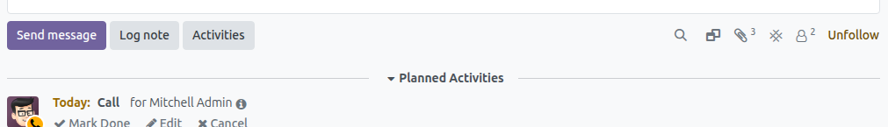
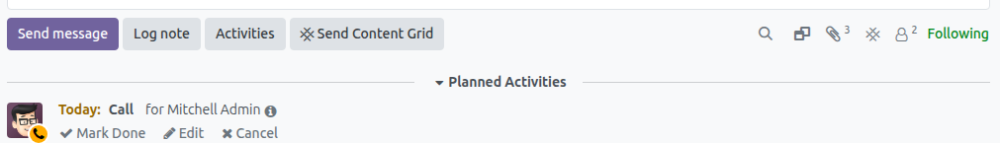

Once we have the configuration made, the links will be done automatically.

All integrated documents will have the contentgrid icon on the attachment:

If you press the icon, a popup will be launched showing the information of it in contentgrid and a link to the app:

Also, related records will show the same icon in the thread menu and will allow us to check the data sent to ContentGrid.

In case we want to force the send, we can do it manually by using the *Allow manual send* field on the configuration.
This will show a button that sends the data to content grid (only attachments not sent)

