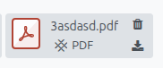
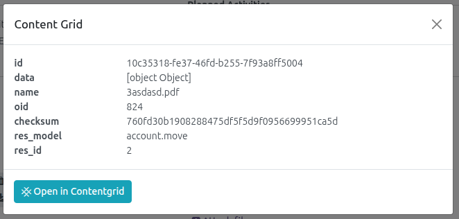

Once we have the configuration made, the links will be done automatically.

All integrated documents will have the contentgrid icon on the attachment:

If you press the icon, a popup will be launched showing the information of it in contentgrid and a link to the app:

